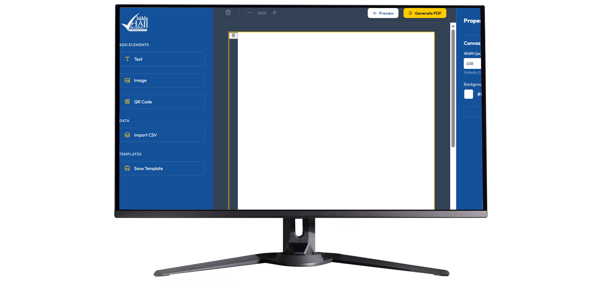

# 🆔 Balda ID Card Generator (Web Edition)

  
  
    

  
  
  
  

   

  [English](#-english) | [日本語](#-japanese) | [Bahasa Indonesia](#-bahasa-indonesia)

---

## 🔒 Privacy Notice
> **Note:** This is a client-side web application. No data is uploaded to any server. All CSV processing and image generation happen locally in your browser to ensure data privacy.

---

## 🇬🇧 English

### ⚡ Project Overview
A web-based automation tool designed for **Balda Company** to streamline employee ID Card creation. Unlike traditional design software, this tool allows HR staff to **drag-and-drop** elements and generate hundreds of ID cards instantly from a single CSV file.

### 🛠️ Key Features
* **Visual Editor:** Drag & drop photos, text, and logos directly on the canvas (powered by `Canvas API`).
* **Batch Automation:** Upload a CSV file to auto-populate names, positions, and IDs.
* **QR Integration:** Auto-generates unique QR codes for each employee.
* **Privacy-First:** Zero-backend. All processing is done locally using JavaScript.

---

## 🇯🇵 Japanese

### ⚡ 概要 (Overview)
「Balda社」のために開発された、WebベースのIDカード自動生成ツールです。従来のソフトウェアとは異なり、このアプリはブラウザ上で動作し、ドラッグ＆ドロップでデザインを調整できます。CSVファイルを読み込むだけで、数百人分のIDカードを瞬時に作成可能です。

### 🛠️ 技術的特徴
* **ビジュアルエディタ:** 写真やテキストをキャンバス上で自由に配置 (Canvas API)。
* **一括自動化:** CSVデータをアップロードして、名前や役職を自動入力。
* **QRコード生成:** 社員ごとのユニークQRコードを自動作成。
* **プライバシー重視:** サーバー不要。すべての処理はブラウザ内のJavaScriptで完結します。

---

## 🇮🇩 Bahasa Indonesia

### ⚡ Gambaran Umum
Aplikasi web yang dibuat untuk mempermudah operasional **Perusahaan Balda**. Alat ini mengubah cara pembuatan ID Card dari manual menjadi otomatis. HRD cukup mengunggah data CSV, dan aplikasi akan merender desain ID Card siap cetak lengkap dengan Foto dan QR Code.

### 🛠️ Fitur Teknis
* **Editor Visual:** Fitur drag-and-drop untuk mengatur tata letak elemen desain.
* **Proses Massal:** Menggunakan `PapaParse` untuk membaca data karyawan dari CSV.
* **Render PDF:** Menggunakan `jsPDF` untuk menyimpan hasil desain menjadi file siap cetak.
* **Client-Side:** Aman, tidak ada data karyawan yang dikirim ke server luar.

---

### 💻 How to Use

1. Clone this repository.
2. Open `index.html` in your browser (Chrome/Edge recommended).
3. Upload the sample CSV provided in `examples/`.
4. Export the results as PDF.
