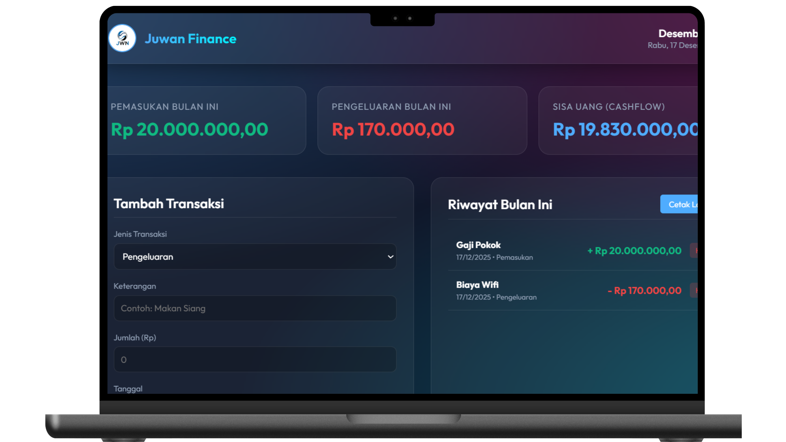

# 💰 JWN Finance Dashboard

  
  
    

  
  
  
  

   

  [English](#-english) | [日本語](#-japanese) | [Bahasa Indonesia](#-bahasa-indonesia)

---

## 🎨 UI Design Spotlight: Glassmorphism
> **Design Note:** This application features a modern **Dark Mode Glassmorphism** UI. I utilized CSS variables (`var(--glass-bg)`) and backdrop filters to create a sleek, translucent data dashboard that minimizes eye strain during nightly reviews.

---

## 🇬🇧 English

### ⚡ Project Overview
**JWN Finance** is a personal analytics dashboard designed to visualize cash flow patterns. As a Data Scientist, I believe that raw numbers (income/expense) are hard to interpret without proper visualization. This tool converts financial data into interactive charts to help make better spending decisions.

### 🛠️ Key Features
* **Interactive Visualization:** Integrated `Chart.js` to render dynamic Line and Bar charts for Income vs. Expense analysis.
* **Cashflow Logic:** Automatically calculates the "Net Cashflow" (Remaining Budget) and visualizes it in real-time.
* **Modern UI/UX:** Built with a "Mobile-First" approach using responsive CSS Grid and Flexbox.
* **Data Structure:** Uses JavaScript Arrays/Objects to simulate financial data streams (easily connectable to a JSON API or CSV backend).

---

## 🇯🇵 Japanese

### ⚡ 概要 (Overview)
個人のキャッシュフロー（お金の流れ）を可視化するための**資産管理ダッシュボード**です。「数字の羅列では家計の状況を把握しづらい」という課題を解決するために開発しました。モダンなUIとグラフを用いて、直感的に資産状況を把握できます。

### 🛠️ 技術的特徴
* **データ可視化:** `Chart.js` ライブラリを使用し、収入と支出の推移を動的なグラフ（折れ線・棒グラフ）で表示します。
* **UIデザイン:** 流行の「グラスモーフィズム（すりガラス風）」デザインを採用し、ダークモードベースの目に優しいインターフェースを構築しました。
* **キャッシュフロー計算:** 収入と支出の差額（残高）を自動計算し、グラフに即座に反映させるロジックを実装しています。

---

## 🇮🇩 Bahasa Indonesia

### ⚡ Gambaran Umum
**JWN Finance** adalah dashboard analitik pribadi untuk memantau kesehatan finansial. Saya membangun alat ini karena aplikasi pencatat keuangan biasa seringkali membosankan. Dengan pendekatan visual, saya mengubah data pemasukan dan pengeluaran menjadi *insight* yang mudah dipahami.

### 🛠️ Fitur Teknis
* **Visualisasi Data:** Menggunakan `Chart.js` untuk merender grafik tren keuangan yang interaktif.
* **Desain Modern:** Mengadopsi gaya desain *Glassmorphism* (efek kaca) dengan warna neon cyber yang futuristik.
* **Logika Cashflow:** Sistem secara otomatis menghitung selisih pemasukan dan pengeluaran untuk menampilkan "Sisa Uang" yang tersedia.
* **Responsive:** Tampilan menyesuaikan secara otomatis baik dibuka di Laptop maupun Smartphone.

---

### 💻 How to Run

1.  **Clone** this repository.
2.  Open `index.html` in any modern browser.
3.  The dashboard will load with sample data visualizations immediately.
