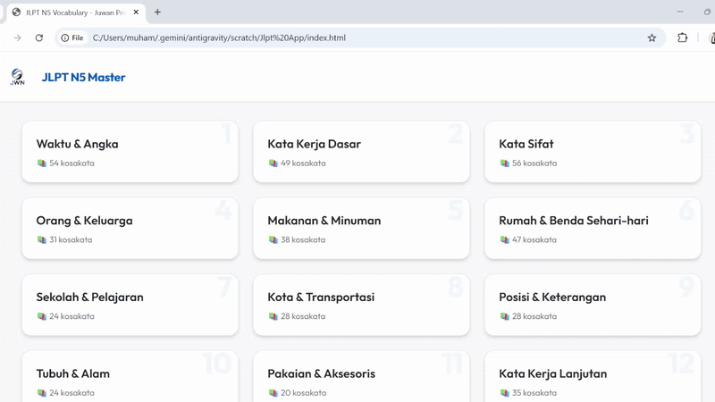

# 🇯🇵 JLPT N5 Flashcard Lite

  
  
    

  
  
  
  

   

  [English](#-english) | [日本語](#-japanese) | [Bahasa Indonesia](#-bahasa-indonesia)

---

## ⚡ Lightweight Architecture
> **Tech Note:** This is a **Single-File Application (SPA)**. All logic (Data JSON, CSS Styling, and JS Class functions) is encapsulated within a single HTML file for portability and zero-latency performance.

---

## 🇬🇧 English

### ⚡ Project Overview
A minimalist, distraction-free flashcard application designed to master **JLPT N5 Vocabulary**. As a Japanese learner, I built this tool to practice "Active Recall". Unlike generic apps, this tool focuses specifically on the vocabulary list required for the N5 exam, categorized by parts of speech (Nouns, Verbs, Adjectives).

### 🛠️ Key Features
* **Flip-Card Interaction:** CSS 3D Transforms (`transform: rotateY`) create a smooth flipping animation to reveal meanings.
* **JSON Data Structure:** Vocabulary data is stored in a structured JSON array, making it scalable to add N4/N3 levels in the future.
* **Category Filtering:** Users can filter words by type (e.g., *Dououshi* for Verbs, *Keiyoushi* for Adjectives).
* **Responsive Design:** Optimized for mobile screens using CSS Grid and Flexbox.

---

## 🇯🇵 Japanese

### ⚡ 概要 (Overview)
日本語能力試験（JLPT）N5合格を目指すために開発した、**Webベースの単語帳アプリ**です。市販のアプリは機能が多すぎるため、学習に集中できるように「シンプルさ」と「軽量さ」を追求しました。

### 🛠️ 技術的特徴
* **単一ファイル構成:** HTML, CSS, JSを1つのファイルに集約し、サーバー
