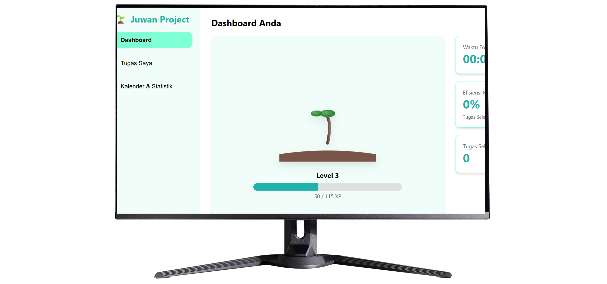

# 🌱 EcoFocus: Gamified Task Manager

  
  
    

  
  
  
  

   

  [English](#-english) | [日本語](#-japanese) | [Bahasa Indonesia](#-bahasa-indonesia)

---

## 🎮 Gamification Logic
> **Unique Selling Point:** This app isn't just a list. It uses a **Reward System Logic**. Every completed task grants **XP (Experience Points)**. As you gain XP, your virtual tree grows visually on the dashboard. It turns productivity into a game.

---

## 🇬🇧 English

### ⚡ Project Overview
**EcoFocus** is a minimalist, gamified to-do list application designed to make productivity satisfying. I built this to solve the "chore" feeling of task management. By combining a clean UI with a virtual growth mechanic, users are motivated to clear their tasks to see their digital garden grow.

### 🛠️ Key Features
* **🌱 Gamified Progression:** Complete tasks to earn XP and level up your virtual tree. The tree visualization changes dynamically based on your level (`renderTree()` logic).
* **📊 Analytics Dashboard:** Tracks your Task Completion Rate and total Focus Time in real-time.
* **📅 Integrated Calendar:** A built-in calendar view (`renderCalendar`) to visualize deadlines and schedule tasks.
* **💾 Local Storage:** Uses browser `localStorage` to save your tasks, XP, and tree progress permanently without needing a server/login.
* **⚡ Priority System:** Categorize tasks by High, Medium, or Low priority with visual color indicators.

---

## 🇯🇵 Japanese

### ⚡ 概要 (Overview)
**EcoFocus** は、タスク管理を「ゲーム感覚」で楽しめるように設計されたWebアプリです。タスクを完了すると経験値（XP）が手に入り、ダッシュボード上の「デジタルな木」が成長していきます。無機質なToDoリストではなく、達成感を視覚化することでモチベーションを維持します。

### 🛠️ 技術的特徴
* **🌱 ゲーミフィケーション:** タスク完了 = 木の成長。JavaScriptでXPロジックとレベルアップシステムを実装しました。
* **📊 分析ダッシュボード:** タスク完了率や集中時間をリアルタイムで計算・表示します。
* **📅 カレンダー機能:** 独自の `renderCalendar` 関数により、タスクのスケジュールを月表示で確認できます。
* **💾 ローカル保存:** ユーザーデータ（タスク、レベル、XP）はすべてブラウザの `localStorage` に保存されるため、ログイン不要ですぐに使えます。

---

## 🇮🇩 Bahasa Indonesia

### ⚡ Gambaran Umum
**EcoFocus** adalah aplikasi manajemen tugas yang menggabungkan produktivitas dengan elemen permainan (*gamification*). Saya merancang aplikasi ini agar pengguna tidak bosan saat menyelesaikan pekerjaan. Setiap tugas yang selesai akan menyumbang "nutrisi" bagi pohon digital yang ada di halaman depan.

### 🛠️ Fitur Teknis
* **🌱 Logika Gamifikasi:** Menyelesaikan tugas memberikan XP. Semakin banyak XP, pohon di dashboard akan berevolusi menjadi lebih besar (Leveling System).
* **📅 Kalender Interaktif:** Fitur kalender bawaan untuk melihat jadwal tugas per tanggal.
* **⚡ Manajemen Prioritas:** Pengguna bisa menandai tugas sebagai *High*, *Medium*, atau *Low* priority dengan indikator warna yang jelas.
* **💾 Database Lokal:** Semua data tersimpan aman di browser pengguna menggunakan `localStorage`, sehingga privasi terjaga dan aplikasi berjalan sangat cepat (tanpa loading server).

---

### 💻 How to Use

1.  **Clone** this repository.
2.  Open `index.html` in your browser.
3.  **Add a Task** via the "My Tasks" menu.
4.  **Check it off** when done to gain XP.
5.  Check the **Dashboard** to see your tree grow!
