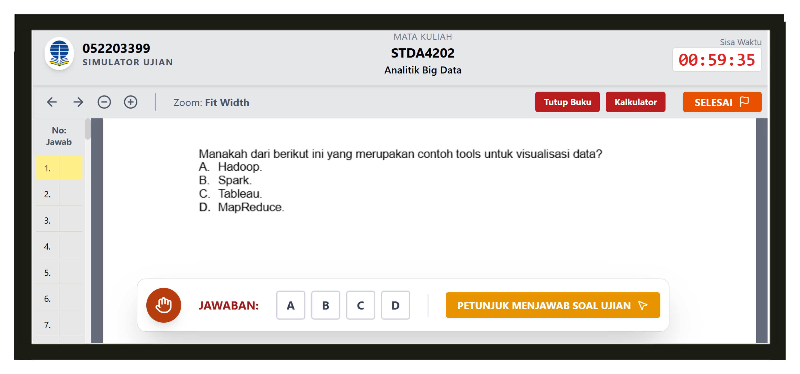

# 🎓 UT Exam Simulator (CBT Engine)

  
  
    

  
  
  
  

   

  [English](#-english) | [日本語](#-japanese) | [Bahasa Indonesia](#-bahasa-indonesia)

---

## 💾 Engineering Spotlight: Serverless Database
> **Technical Note:** This application runs entirely on the client-side. I built a **Custom IndexedDB Wrapper** (`db.js`) from scratch without external libraries to manage exam sessions and history persistance. It demonstrates how to handle asynchronous data transactions natively in the browser.

---

## 🇬🇧 English

### ⚡ Project Overview
A custom **Computer Based Test (CBT)** engine designed to simulate the exact examination environment of *Universitas Terbuka*. I developed this tool to bridge the gap between static PDF question papers and the real-time digital exam experience.

### 🛠️ Key Technical Features
* **PDF.js Integration:** Renders exam question papers (PDF) directly onto the canvas, enabling a split-screen experience (Questions on Left, Answer Sheet on Right).
* **Smart Answer Parsing:** The system accepts raw answer strings (e.g., "1.A, 2.B") and uses Regex to parse them into a grading logic automatically.
* **State Management:** The `app.js` handles complex states including timers, question navigation, and answer persistence to prevent data loss on refresh.
* **Responsive UI:** Built with Tailwind CSS to replicate the official exam interface pixel-perfectly.

---

## 🇯🇵 Japanese

### ⚡ 概要 (Overview)
インドネシアのオープン大学（Universitas Terbuka）のCBT試験環境を完全に再現した**模擬試験エンジン**です。単なるPDFの問題集を解くだけではなく、本番と同じインターフェースで緊張感を持って学習するために開発しました。

### 🛠️ 技術的特徴
* **PDFレンダリング:** `PDF.js`ライブラリを使用し、ブラウザ上で問題用紙（PDF）を直接描画・操作可能にしました。
* **自動採点ロジック:** 解答キー（例: "1.A, 2.B"）を文字列として入力すると、正規表現を用いて自動的に採点システムに変換します。
* **ローカルDB設計:** 外部サーバーを使わず、ブラウザ標準の `IndexedDB` を直接操作する `db.js` を自作し、試験履歴やセッションデータを永続化しています。
* **UXデザイン:** 本番の試験特有のUI/UXをTailwind CSSで忠実に再現しました。

---

## 🇮🇩 Bahasa Indonesia

### ⚡ Gambaran Umum
Mesin **Computer Based Test (CBT)** yang dirancang khusus untuk mensimulasikan antarmuka ujian asli **Universitas Terbuka**. Aplikasi ini lahir dari kebutuhan pribadi saya untuk berlatih mengerjakan soal-soal Latihan Mandiri (LM) yang biasanya hanya berupa file PDF, agar bisa dikerjakan layaknya ujian sungguhan dengan pengatur waktu.

### 🛠️ Fitur Teknis
* **Simulasi Realistis:** Meniru UI, penghitung waktu mundur, dan navigasi soal persis seperti aplikasi ujian asli kampus.
* **PDF Parser:** Mengintegrasikan `PDF.js` untuk menampilkan soal ujian di sisi kiri layar sambil menjawab di sisi kanan.
* **Manajemen Database Client-Side:** Menggunakan **IndexedDB** (tanpa database server) untuk menyimpan riwayat nilai dan sesi ujian. Saya menulis modul `db.js` secara manual untuk performa maksimal.
* **Analisis Hasil:** Menampilkan skor otomatis dan kunci jawaban yang benar setelah ujian selesai.

---

### 💻 How to Run

1.  Clone this repository.
2.  Open `index.html` in your browser.
3.  **Create New Exam:** Upload your PDF question file and input the answer key string.
4.  **Start Simulation:** The app will enter "Exam Mode" (Fullscreen recommended).
